#   BanglaVLM

## Vision-Language Fine-Tuning & Multi-Dataset Evaluation for Bengali

<p align="center">
  <strong>Parameter-Efficient Bengali Vision-Language Learning with Cross-Dataset Evaluation</strong>
</p>

<p align="center">
  <a href="https://huggingface.co/HuggingFaceTB/SmolVLM2-2.2B-Instruct">
    
  </a>
  <a href="https://github.com/huggingface/transformers">
    
  </a>
  <a href="https://github.com/huggingface/peft">
    
  </a>
  <a href="https://pytorch.org/">
    
  </a>
  <a href="https://github.com/bhaskarpal1707/BanglaVLM">
    
  </a>
</p>

<p align="center">
  <a href="https://huggingface.co/bhaskar1707/smolvlm2-bangla-bayanno-lora">🤗 BanglaVLM-v1</a>
  &nbsp; • &nbsp;
  <a href="https://huggingface.co/bhaskar1707/smolvlm2-bangla-bayanno-chitrojera-lora">🤗 BanglaVLM-v2</a>
  &nbsp; • &nbsp;
  <a href="https://github.com/bhaskarpal1707/BanglaVLM">💻 Repository</a>
</p>

---

## 📌 Table of Contents

- [Overview](#-overview)
- [Research Motivation](#-research-motivation)
- [Research Questions](#-research-questions)
- [Research Objectives](#-research-objectives)
- [Research Contributions](#-research-contributions)
- [System Architecture](#-system-architecture)
- [Experimental Pipeline](#-experimental-pipeline)
- [Base Model](#-base-model)
- [Datasets](#-datasets)
- [Dataset Roles](#-dataset-roles)
- [Experimental Design](#-experimental-design)
- [Experiment 1](#-experiment-1--baseline-vs-single-dataset-fine-tuning)
- [Experiment 2](#-experiment-2--multi-dataset-joint-fine-tuning)
- [Experiment 3](#-experiment-3--cross-dataset-generalization)
- [Training Configuration](#-training-configuration)
- [Evaluation Protocol](#-evaluation-protocol)
- [Quantitative Results](#-quantitative-results)
- [Cross-Dataset Results](#-cross-dataset-results)
- [Qualitative Results](#-qualitative-results)
- [Visualization Gallery](#-visualization-gallery)
- [Runtime & GPU Analysis](#-runtime--gpu-analysis)
- [Repository Structure](#-repository-structure)
- [Prediction Artifacts](#-prediction-artifacts)
- [Result Artifacts](#-result-artifacts)
- [Project Summary](#-project-summary)
- [Quickstart](#-quickstart)
- [Inference](#-inference)
- [Hugging Face Models](#-hugging-face-models)
- [Reproducibility](#-reproducibility)
- [Key Findings](#-key-findings)
- [Limitations](#-limitations)
- [Future Work](#-future-work)
- [Citation](#-citation)
- [Author](#-author)

---

# 🔬 Overview

**BanglaVLM** is an end-to-end research project investigating Bengali multimodal Vision-Language Models (VLMs) through **Parameter-Efficient Fine-Tuning (PEFT)** and **multi-dataset evaluation**.

The project starts from the lightweight yet capable:

```text
HuggingFaceTB/SmolVLM2-2.2B-Instruct
```

and adapts it to Bengali Visual Question Answering (VQA) using **Low-Rank Adaptation (LoRA)**.

The research is intentionally broader than optimizing a model on a single benchmark. It asks whether a relatively lightweight VLM can:

- learn Bengali visual-language alignment,
- improve Bengali answer generation,
- handle different Bengali VQA formats,
- transfer knowledge across datasets, and
- generalize to an unseen Bengali visual benchmark.

The complete research progression is:

```text
Base SmolVLM2
      │
      ▼
Single-Dataset Bengali Adaptation
      │
      ▼
BanglaVLM-v1
      │
      ▼
Multi-Dataset Bengali Adaptation
      │
      ▼
BanglaVLM-v2
      │
      ▼
Cross-Dataset / Zero-Shot Evaluation
      │
      ▼
BanglaVerse
```

---

# 🎯 Research Motivation

Bengali is a major language, but Bengali multimodal resources and evaluation settings are still comparatively limited.

A general VLM may have strong visual understanding while still producing:

- English-biased answers,
- weak Bengali linguistic alignment,
- generic descriptions,
- incorrect visual details,
- dataset-specific behavior, or
- poor transfer to a different Bengali VQA distribution.

BanglaVLM therefore studies **language adaptation + visual grounding + cross-dataset generalization** together.

The project deliberately separates:

```text
In-Domain Performance
        vs.
Cross-Dataset Generalization
```

because strong performance on a training distribution does not automatically demonstrate robust Bengali multimodal capability.

---

# ❓ Research Questions

### RQ1 — In-Domain Bengali Adaptation

> Does LoRA fine-tuning on a Bengali VQA dataset improve the Bengali visual-language performance of SmolVLM2-2.2B?

Evaluated through:

```text
Base SmolVLM2 → BanglaVLM-v1
```

---

### RQ2 — Multi-Dataset Learning

> Does jointly training on structurally different Bengali VQA datasets improve multimodal adaptability compared with single-dataset training?

Evaluated through:

```text
Bangla-Bayanno + ChitroJera → BanglaVLM-v2
```

---

### RQ3 — Cross-Dataset Generalization

> Can a Bengali VLM trained on Bengali visual datasets transfer to an unseen Bengali visual benchmark?

Evaluated using:

```text
BanglaVerse
```

as the unseen test domain.

---

# 🎯 Research Objectives

1. **Bengali Multimodal Adaptation**  
   Adapt a lightweight VLM for Bengali visual-language interaction.

2. **Parameter-Efficient Training**  
   Use LoRA rather than updating the entire 2.2B backbone.

3. **Multi-Dataset Learning**  
   Investigate whether different Bengali VQA distributions complement one another.

4. **Cross-Dataset Generalization**  
   Evaluate transfer to an unseen Bengali VQA dataset.

5. **Reproducible Evaluation**  
   Preserve predictions, metrics, timing, reports, and visualizations.

---

# 💡 Research Contributions

### 1. Bengali VLM Adaptation

A lightweight VLM is adapted specifically for Bengali multimodal interaction.

### 2. Parameter-Efficient Fine-Tuning

LoRA provides a lightweight adaptation mechanism without requiring full backbone fine-tuning.

### 3. Joint Bengali VQA Training

Bangla-Bayanno and ChitroJera are jointly used to construct BanglaVLM-v2.

### 4. Cross-Dataset Audit

BanglaVerse is used as an unseen benchmark to test transfer.

### 5. Reproducible Experiment Organization

The repository separates:

```text
models
predictions
results
project_summary
timing
visualizations
notebooks
```

---

# 🧠 System Architecture

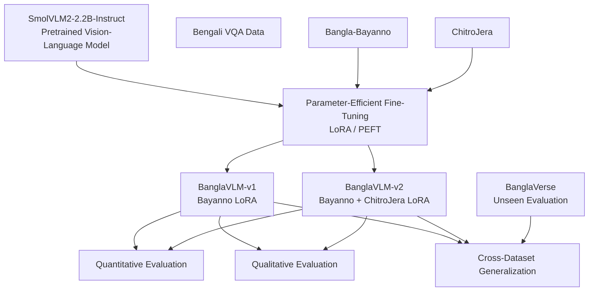
```mermaid
flowchart TD
    A["SmolVLM2-2.2B-Instruct<br/>Pretrained Vision-Language Model"]

    B["Bengali VQA Data"]
    B1["Bangla-Bayanno"]
    B2["ChitroJera"]
    B3["BanglaVerse<br/>Unseen Evaluation"]

    C["Parameter-Efficient Fine-Tuning<br/>LoRA / PEFT"]

    D["BanglaVLM-v1<br/>Bayanno LoRA"]
    E["BanglaVLM-v2<br/>Bayanno + ChitroJera LoRA"]

    F["Quantitative Evaluation"]
    G["Qualitative Evaluation"]
    H["Cross-Dataset Generalization"]

    A --> C
    B1 --> C
    B2 --> C
    C --> D
    C --> E

    D --> F
    E --> F

    D --> G
    E --> G

    D --> H
    E --> H
    B3 --> H
```

---

# 🧪 Experimental Pipeline

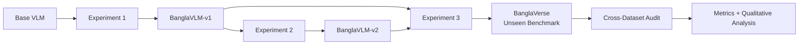
```mermaid
flowchart LR
    A["Base VLM"] --> B["Experiment 1"]
    B --> C["BanglaVLM-v1"]

    C --> D["Experiment 2"]
    D --> E["BanglaVLM-v2"]

    C --> F["Experiment 3"]
    E --> F

    F --> G["BanglaVerse<br/>Unseen Benchmark"]

    G --> H["Cross-Dataset Audit"]
    H --> I["Metrics + Qualitative Analysis"]
```

### Experimental Story

| Stage | Question | Training | Evaluation |
|---|---|---|---|
| **Experiment 1** | Does Bengali fine-tuning help? | Bangla-Bayanno | Bangla-Bayanno |
| **Experiment 2** | Does joint training help? | Bangla-Bayanno + ChitroJera | Bayanno + ChitroJera |
| **Experiment 3** | Does it generalize? | Existing trained models | Bayanno + ChitroJera + unseen BanglaVerse |

---

# 🤖 Base Model

```text
HuggingFaceTB/SmolVLM2-2.2B-Instruct
```

The base model provides the pretrained multimodal foundation.

BanglaVLM does not attempt to relearn visual understanding from scratch. Instead, it adapts the pretrained model to Bengali visual-language tasks through PEFT.

---

# 📚 Datasets

| Dataset | QA Pairs | Images | Role |
|---|---:|---:|---|
| **Bangla-Bayanno** | 53,817 | 4,673 | Primary training + in-domain benchmark |
| **ChitroJera** | 12,231 | 12,231 | Joint training + benchmark |
| **BanglaVerse** | 1,143 | 1,143 | Unseen / zero-shot generalization |

---

## 🇧🇩 Bangla-Bayanno

Bangla-Bayanno provides rich descriptive Bengali visual QA.

It is the primary dataset for **BanglaVLM-v1**.

Its role includes:

- Bengali visual grounding
- descriptive answer generation
- natural-scene understanding
- Bengali VQA adaptation

---

## 🖼️ ChitroJera

ChitroJera provides a structurally different Bengali visual-question distribution.

It is introduced in Experiment 2 to test whether joint training improves adaptability.

---

## 🌏 BanglaVerse

BanglaVerse is used as the unseen evaluation benchmark.

The important distinction is:

```text
Training datasets
    ↓
Bangla-Bayanno + ChitroJera

Unseen evaluation
    ↓
BanglaVerse
```

This allows the project to distinguish **memorization / in-domain adaptation** from **cross-dataset transfer**.

---

# 🧪 Experiment 1 — Baseline vs Single-Dataset Fine-Tuning

### Objective

Measure the effect of Bengali LoRA adaptation on Bangla-Bayanno.

### Models

```text
Base SmolVLM2-2.2B-Instruct
             VS
BanglaVLM-v1
```

### Training

```text
Bangla-Bayanno
      ↓
LoRA Fine-Tuning
      ↓
BanglaVLM-v1
```

### Result

From the repository's audit CSV:

| Model | Dataset | Exact Match | Normalized EM | ROUGE-L | N |
|---|---|---:|---:|---:|---:|
| Base SmolVLM2 | Bangla-Bayanno | 30.67% | 30.67% | 31.22% | 300 |
| **BanglaVLM-v1** | Bangla-Bayanno | **33.47%** | **33.51%** | **34.17%** | 5,004 |

### Absolute improvement

```text
Exact Match:
33.47% - 30.67%
≈ +2.80 percentage points

Normalized EM:
33.51% - 30.67%
≈ +2.85 percentage points

ROUGE-L:
34.17% - 31.22%
≈ +2.94 percentage points
```

---

## Experiment 1 Visual Audit

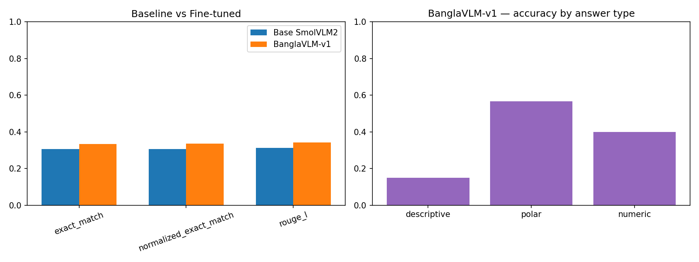

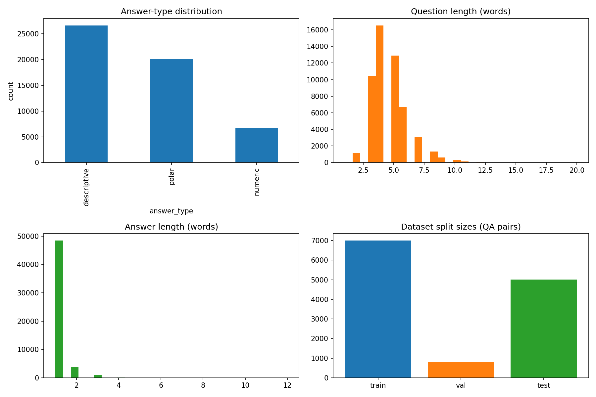

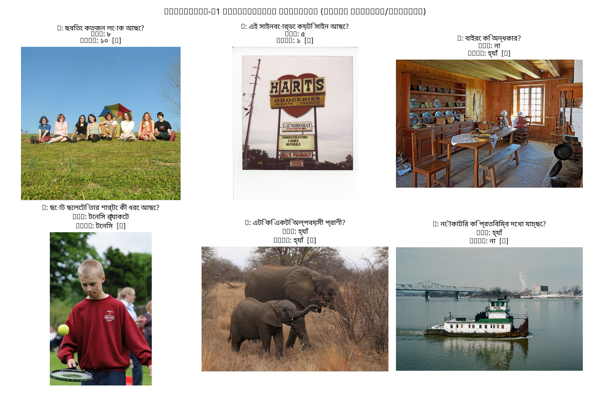

<details>
<summary><strong>🖥️ Experiment 1 GPU Usage</strong></summary>

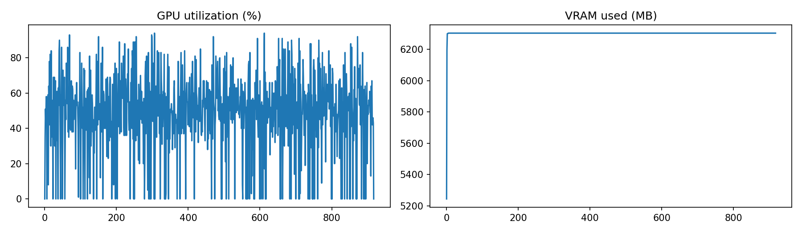

</details>

<details>
<summary><strong>🔎 Experiment 1 Qualitative Examples</strong></summary>

See the dedicated qualitative examples directory:

[Experiment 1 Qualitative Examples](visualizations/experiment1_qualitative_examples/)

</details>

---

# 🧪 Experiment 2 — Multi-Dataset Joint Fine-Tuning

## Objective

Determine whether jointly training on Bangla-Bayanno and ChitroJera improves multi-task Bengali VQA performance.

### Training

```text
Bangla-Bayanno
      +
ChitroJera
      ↓
Joint LoRA Fine-Tuning
      ↓
BanglaVLM-v2
```

---

## Experiment 2 Results

### Bangla-Bayanno

| Model | Exact Match | Normalized EM | ROUGE-L |
|---|---:|---:|---:|
| Base SmolVLM2 | 0.00% | 0.00% | 0.23% |
| BanglaVLM-v1 | **33.47%** | **33.51%** | **34.17%** |
| BanglaVLM-v2 | 32.33% | 32.37% | 33.11% |

### ChitroJera

| Model | Exact Match | Normalized EM | ROUGE-L |
|---|---:|---:|---:|
| Base SmolVLM2 | 0.00% | 0.00% | 0.18% |
| BanglaVLM-v1 | 3.10% | 3.10% | 5.34% |
| **BanglaVLM-v2** | **6.29%** | **6.29%** | **9.95%** |

### Interpretation

The joint model does not simply maximize every individual in-domain score.

Instead, the important result is the improved performance on the structurally different **ChitroJera** benchmark:

```text
BanglaVLM-v1 → 3.10% EM
BanglaVLM-v2 → 6.29% EM
```

This represents approximately a **3.19 percentage-point improvement** in Exact Match.

---

## Experiment 2 Visual Audit

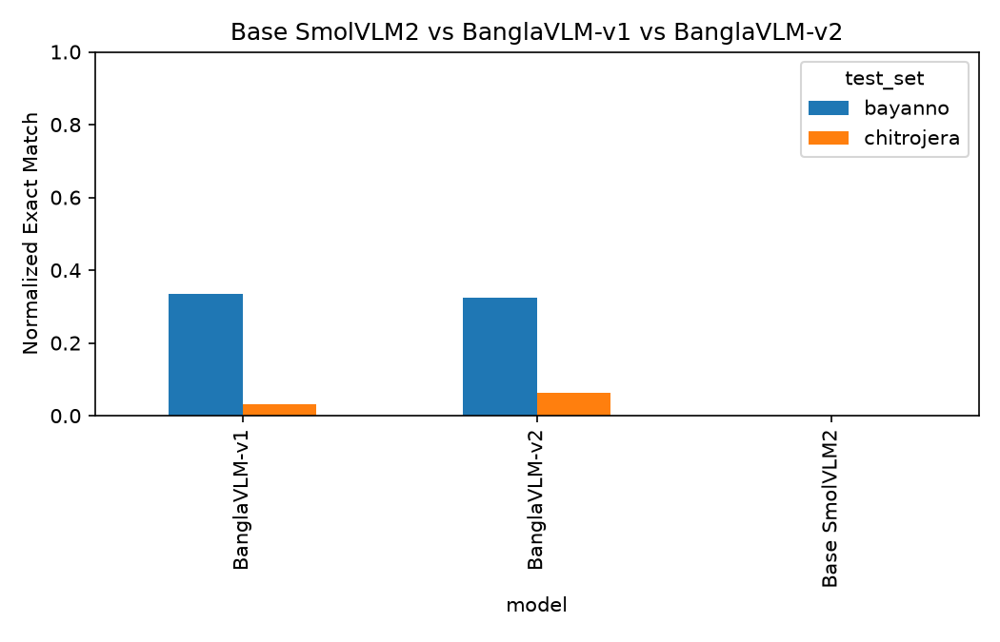

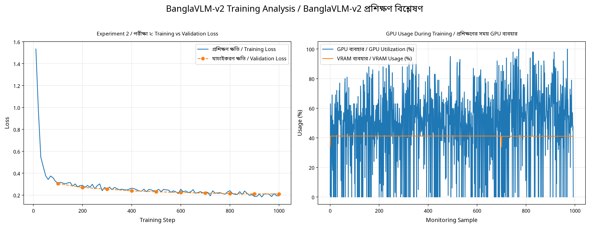

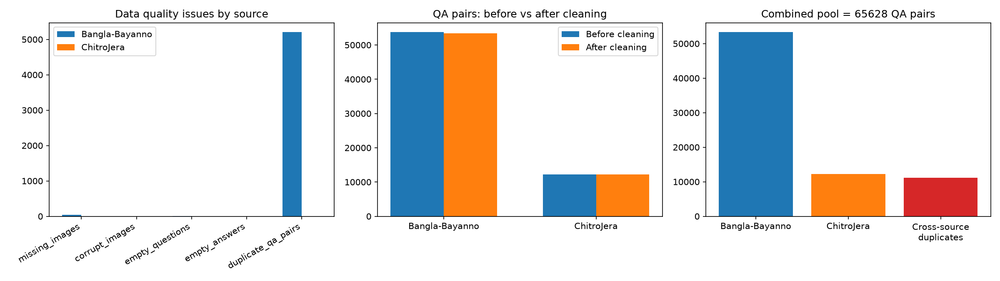

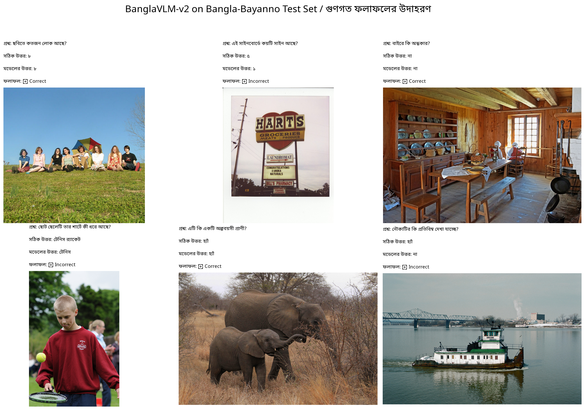

<details>
<summary><strong>🖥️ Experiment 2 GPU Usage</strong></summary>

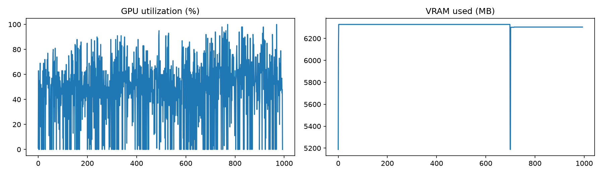

</details>

---

# 🧪 Experiment 3 — Cross-Dataset Generalization

## Objective

Evaluate the Base model, BanglaVLM-v1 and BanglaVLM-v2 across multiple datasets, including the unseen BanglaVerse benchmark.

### Models

```text
Base SmolVLM2
BanglaVLM-v1
BanglaVLM-v2
```

### Evaluation

```text
                 ┌── Bangla-Bayanno
Models ──────────┼── ChitroJera
                 └── BanglaVerse (UNSEEN)
```

---

# 🌐 Experiment 3 Results

| Model | Bangla-Bayanno EM | ChitroJera EM | BanglaVerse EM |
|---|---:|---:|---:|
| Base SmolVLM2 | 0.00% | 0.00% | 0.00% |
| BanglaVLM-v1 | **34.20%** | 3.20% | 0.00% |
| BanglaVLM-v2 | 31.20% | **6.00%** | **0.40%** |

### Normalized Exact Match

| Model | Bangla-Bayanno | ChitroJera | BanglaVerse |
|---|---:|---:|---:|
| Base SmolVLM2 | 0.00% | 0.00% | 0.00% |
| BanglaVLM-v1 | **34.20%** | 3.20% | 0.00% |
| BanglaVLM-v2 | 31.20% | **6.00%** | **0.40%** |

### ROUGE-L

| Model | Bangla-Bayanno | ChitroJera | BanglaVerse |
|---|---:|---:|---:|
| Base SmolVLM2 | 0.06% | 0.13% | 0.55% |
| BanglaVLM-v1 | **34.73%** | 5.17% | 0.37% |
| BanglaVLM-v2 | 31.93% | **9.36%** | **1.56%** |

---

## 🔎 Cross-Dataset Interpretation

The experiment reveals an important trade-off.

### BanglaVLM-v1

BanglaVLM-v1 is strongest on the Bangla-Bayanno distribution:

```text
Bangla-Bayanno EM = 34.20%
```

but obtains:

```text
BanglaVerse EM = 0.00%
```

on the unseen benchmark.

### BanglaVLM-v2

BanglaVLM-v2 achieves:

```text
ChitroJera EM = 6.00%
BanglaVerse EM = 0.40%
```

and the highest BanglaVerse ROUGE-L among the evaluated models:

```text
BanglaVerse ROUGE-L = 1.56%
```

Thus, the joint-training model shows a measurable but still limited transfer signal on the unseen benchmark.

---

## Experiment 3 Visualizations

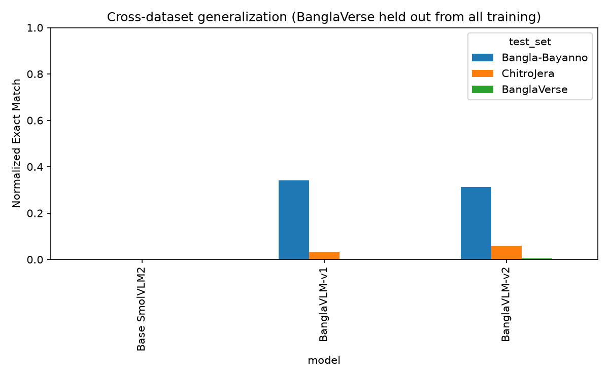

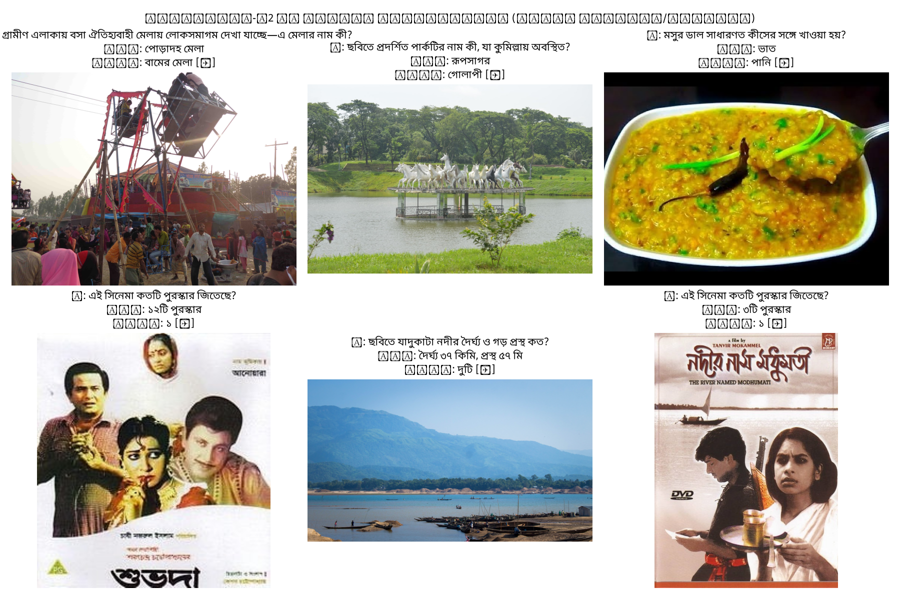

---

# 📊 Final Benchmark Snapshot

The repository's `final_results.csv` reports the following final Exact Match matrix:

| Model | Bangla-Bayanno | ChitroJera | BanglaVerse |
|---|---:|---:|---:|
| Base SmolVLM2 | **0.00%** | **0.00%** | **0.00%** |
| BanglaVLM-v1 | **34.20%** | **3.20%** | **0.00%** |
| BanglaVLM-v2 | **31.20%** | **6.00%** | **0.40%** |

> **Important:** These values are taken from the repository's `project_summary/final_results.csv`. The more detailed `audit_all_metrics.csv` additionally contains normalized Exact Match, ROUGE-L and sample counts.

---

# 📈 Quantitative Audit

The repository contains a consolidated audit file:

```text
project_summary/audit_all_metrics.csv
```

It records:

```text
experiment
model
dataset
exact_match
normalized_exact_match
rouge_l
n
```

This makes it possible to reconstruct the benchmark tables directly from the stored evaluation data.

### Main audit table

| Experiment | Model | Dataset | EM | Norm. EM | ROUGE-L | N |
|---|---|---|---:|---:|---:|---:|
| Exp1 | Base SmolVLM2 | Bangla-Bayanno | 30.67% | 30.67% | 31.22% | 300 |
| Exp1 | BanglaVLM-v1 | Bangla-Bayanno | 33.47% | 33.51% | 34.17% | 5,004 |
| Exp2 | Base SmolVLM2 | Bayanno | 0.00% | 0.00% | 0.23% | 5,004 |
| Exp2 | Base SmolVLM2 | ChitroJera | 0.00% | 0.00% | 0.18% | 1,224 |
| Exp2 | BanglaVLM-v1 | Bayanno | 33.47% | 33.51% | 34.17% | 5,004 |
| Exp2 | BanglaVLM-v1 | ChitroJera | 3.10% | 3.10% | 5.34% | 1,224 |
| Exp2 | BanglaVLM-v2 | Bayanno | 32.33% | 32.37% | 33.11% | 5,004 |
| Exp2 | BanglaVLM-v2 | ChitroJera | 6.29% | 6.29% | 9.95% | 1,224 |
| Exp3 | Base SmolVLM2 | Bangla-Bayanno | 0.00% | 0.00% | 0.06% | 500 |
| Exp3 | Base SmolVLM2 | ChitroJera | 0.00% | 0.00% | 0.13% | 500 |
| Exp3 | Base SmolVLM2 | BanglaVerse | 0.00% | 0.00% | 0.55% | 500 |
| Exp3 | BanglaVLM-v1 | Bangla-Bayanno | 34.20% | 34.20% | 34.73% | 500 |
| Exp3 | BanglaVLM-v1 | ChitroJera | 3.20% | 3.20% | 5.17% | 500 |
| Exp3 | BanglaVLM-v1 | BanglaVerse | 0.00% | 0.00% | 0.37% | 500 |
| Exp3 | BanglaVLM-v2 | Bangla-Bayanno | 31.20% | 31.20% | 31.93% | 500 |
| Exp3 | BanglaVLM-v2 | ChitroJera | 6.00% | 6.00% | 9.36% | 500 |
| Exp3 | BanglaVLM-v2 | BanglaVerse | 0.40% | 0.40% | 1.56% | 500 |

---

# 🖼️ Visualization Gallery

The repository currently contains a dedicated visualization suite covering dataset analysis, training, GPU usage, timing, model comparisons and qualitative audits.

## 📊 Project-Level Audit

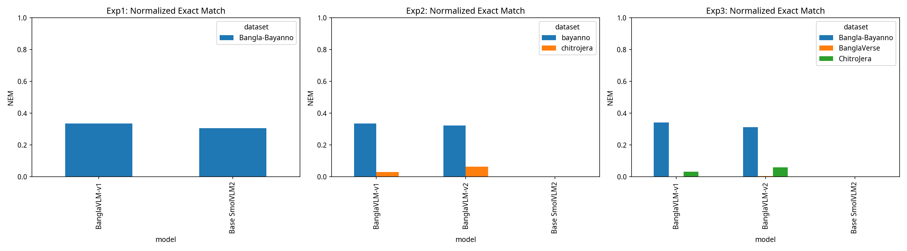

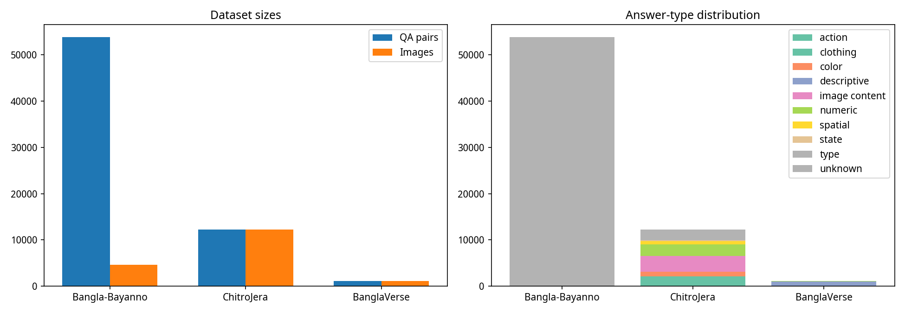

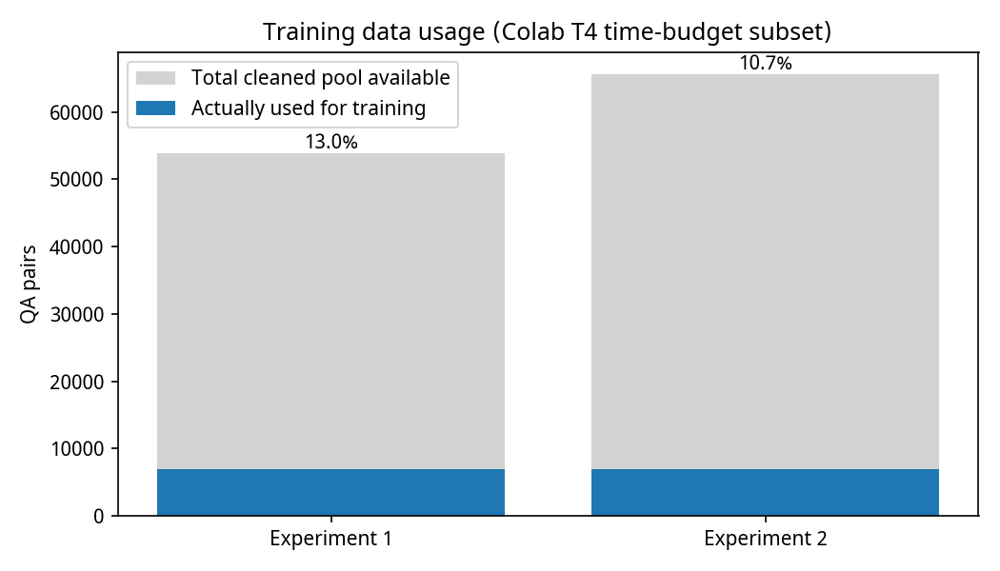

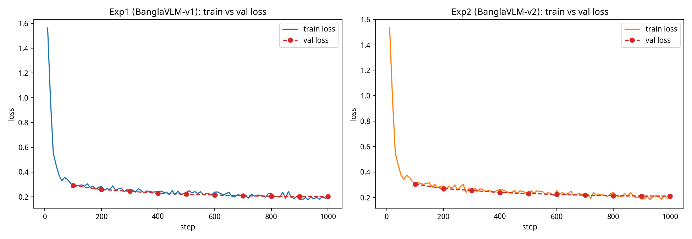

---

## ⚖️ Experiment Comparison

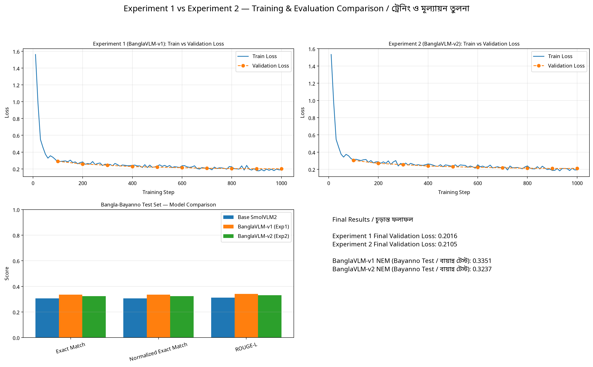

---

## 🧪 Experiment 1


---

## 🧪 Experiment 2


---

## 🌐 Experiment 3


---

## 🧠 BanglaVLM-v2 Visual Audit

### Bangla-Bayanno

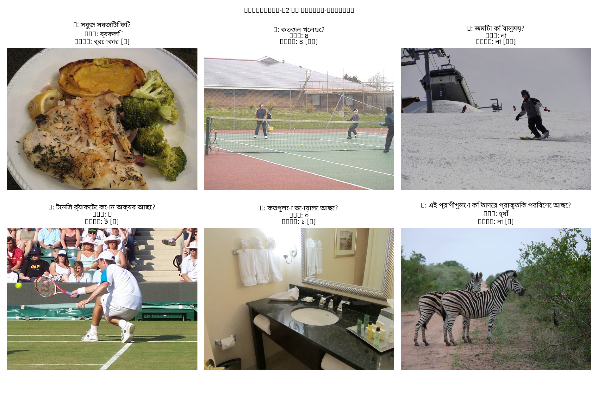

### ChitroJera

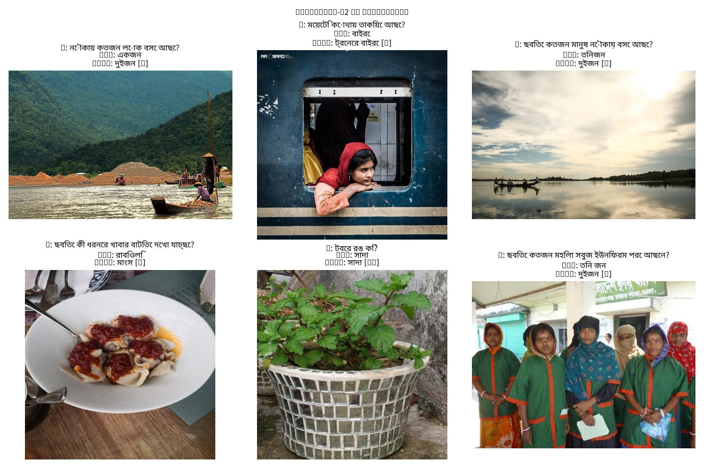

### Unseen BanglaVerse

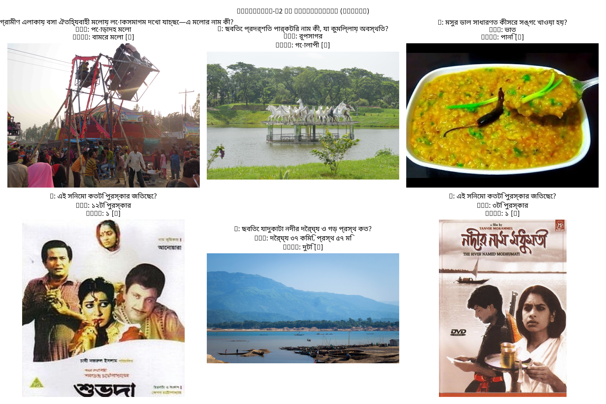

---

# 🖥️ Runtime & GPU Analysis

The project also preserves execution and hardware-oriented visualizations.

<details>
<summary><strong>GPU Usage</strong></summary>

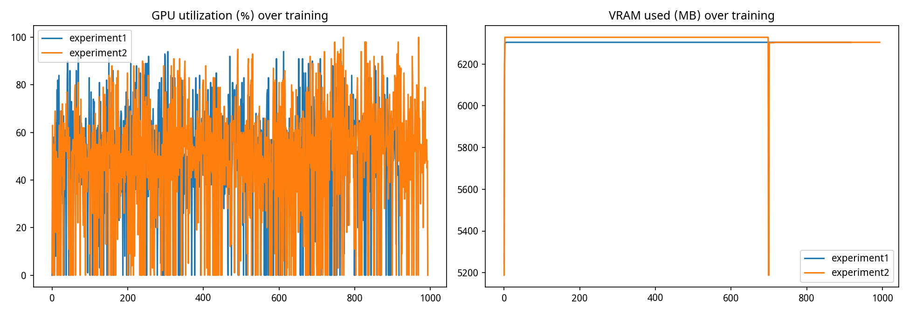

</details>

<details>
<summary><strong>Timing Breakdown</strong></summary>

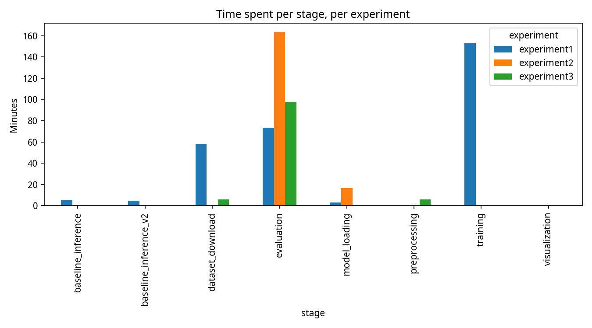

</details>

These artifacts are useful when assessing the computational cost and practical reproducibility of the experiments.

---

# ⚙️ Training Configuration

| Parameter | Configuration |
|---|---|
| Base Model | `HuggingFaceTB/SmolVLM2-2.2B-Instruct` |
| Fine-Tuning | LoRA / PEFT |
| LoRA Rank | `16` |
| LoRA Alpha | `32` |
| LoRA Dropout | `0.05` |
| Target Modules | `all-linear` |
| Learning Rate | `2e-4` |
| Scheduler | Cosine |
| Warmup Steps | `30` |
| Precision | FP16 (`torch.float16`) |
| Per-Device Batch Size | `1` |
| Gradient Accumulation | `8` |
| Effective Batch Size | `8` |
| Training Hardware | NVIDIA Tesla T4 |

---

# 🔧 LoRA Methodology

LoRA introduces a trainable low-rank update instead of directly updating the complete pretrained weight matrix.

Conceptually:

```text
Original Layer

        W


LoRA Adapted Layer

        W + ΔW

where

        ΔW = B × A
```

The pretrained backbone remains largely frozen while the LoRA parameters learn the Bengali multimodal adaptation.

This provides:

- lower trainable parameter count,
- lower memory requirements,
- smaller adapter artifacts,
- efficient experimentation, and
- easier distribution of task-specific adapters.

---

# 📁 Repository Structure

```text
BanglaVLM/
│
├── 📁 notebooks/
│   └── Experimental Google Colab notebooks
│
├── 📁 predictions/
│   ├── Experiment 1 prediction files
│   ├── Experiment 2 prediction files
│   └── Experiment 3 cross-dataset prediction files
│
├── 📁 project_summary/
│   ├── audit_all_metrics.csv
│   ├── comprehensive_analysis_report.md
│   ├── environment.json
│   ├── final_report.md
│   ├── final_results.csv
│   ├── final_results.json
│   ├── hyperparameters.json
│   ├── total_runtime_summary.csv
│   └── total_runtime_summary.json
│
├── 📁 results/
│   ├── experiment1/
│   ├── experiment2/
│   └── experiment3/
│
├── 📁 timing/
│   └── Execution and runtime artifacts
│
├── 📁 visualizations/
│   ├── Project-level audit figures
│   ├── Experiment 1 figures
│   ├── Experiment 2 figures
│   ├── Experiment 3 figures
│   └── Qualitative example galleries
│
├── .gitignore
└── README.md
```

---

# 📦 Prediction Artifacts

The `predictions/` directory contains model-generated JSON outputs.

It includes prediction files for:

### Experiment 1

```text
experiment1_baseline_predictions.json
experiment1_test_predictions.json
```

### Experiment 2

```text
experiment2_BanglaVLM-v1_bayanno.json
experiment2_BanglaVLM-v1_chitrojera.json
experiment2_BanglaVLM-v2_bayanno.json
experiment2_BanglaVLM-v2_chitrojera.json
experiment2_Base_SmolVLM2_bayanno.json
experiment2_Base_SmolVLM2_chitrojera.json
experiment2_all_predictions.json
```

### Experiment 3

```text
experiment3_BanglaVLM-v1_Bangla-Bayanno.json
experiment3_BanglaVLM-v1_BanglaVerse.json
experiment3_BanglaVLM-v1_ChitroJera.json

experiment3_BanglaVLM-v2_Bangla-Bayanno.json
experiment3_BanglaVLM-v2_BanglaVerse.json
experiment3_BanglaVLM-v2_ChitroJera.json

experiment3_Base_SmolVLM2_Bangla-Bayanno.json
experiment3_Base_SmolVLM2_BanglaVerse.json
experiment3_Base_SmolVLM2_ChitroJera.json

experiment3_cross_predictions.json
```

---

# 📊 Result Artifacts

The `results/` directory is separated by experimental stage:

```text
results/
├── experiment1/
├── experiment2/
└── experiment3/
```

This makes the experimental outputs easier to audit independently.

---

# 📝 Project Summary Artifacts

The `project_summary/` directory contains the consolidated research artifacts:

| File | Purpose |
|---|---|
| `audit_all_metrics.csv` | Consolidated benchmark metrics |
| `final_results.csv` | Final EM comparison matrix |
| `final_results.json` | Machine-readable final results |
| `comprehensive_analysis_report.md` | Detailed analysis |
| `final_report.md` | Final research report |
| `hyperparameters.json` | Training configuration |
| `environment.json` | Environment information |
| `total_runtime_summary.csv` | Runtime summary |
| `total_runtime_summary.json` | Machine-readable runtime summary |

---

# 🚀 Quickstart

## 1. Install Dependencies

```bash
pip install torch
pip install transformers
pip install peft
pip install accelerate
pip install pillow
```

---

## 2. Load the Base Model

```python
import torch

from transformers import (
    AutoProcessor,
    AutoModelForVision2Seq
)

base_model_id = "HuggingFaceTB/SmolVLM2-2.2B-Instruct"

processor = AutoProcessor.from_pretrained(
    base_model_id
)

model = AutoModelForVision2Seq.from_pretrained(
    base_model_id,
    torch_dtype=torch.float16,
    device_map="auto"
)
```

---

# 🤗 Load BanglaVLM-v2

```python
from peft import PeftModel

peft_model_id = (
    "bhaskar1707/"
    "smolvlm2-bangla-bayanno-chitrojera-lora"
)

model = PeftModel.from_pretrained(
    model,
    peft_model_id
)
```

---

# 🖼️ Inference

```python
from PIL import Image

image_path = "sample_image.jpg"
image = Image.open(image_path)

prompt = """
<image>
এই ছবিতে কী দেখা যাচ্ছে বিস্তারিত বাংলায় বলুন।
"""

inputs = processor(
    text=prompt,
    images=image,
    return_tensors="pt"
).to("cuda")

generated_ids = model.generate(
    **inputs,
    max_new_tokens=128
)

generated_text = processor.batch_decode(
    generated_ids,
    skip_special_tokens=True
)

print("BanglaVLM Response:")
print(generated_text[0])
```

---

# 🤗 Hugging Face Models

## BanglaVLM-v1

**Training:** Bangla-Bayanno

[](https://huggingface.co/bhaskar1707/smolvlm2-bangla-bayanno-lora)

**Model:**  
`bhaskar1707/smolvlm2-bangla-bayanno-lora`

---

## BanglaVLM-v2

**Training:** Bangla-Bayanno + ChitroJera

[](https://huggingface.co/bhaskar1707/smolvlm2-bangla-bayanno-chitrojera-lora)

**Model:**  
`bhaskar1707/smolvlm2-bangla-bayanno-chitrojera-lora`

---

# 📦 Adapter Artifacts

The LoRA repositories contain lightweight adapter artifacts such as:

```text
adapter_model.safetensors
adapter_config.json
tokenizer_config.json
preprocessor_config.json
```

The adapter contains the learned PEFT parameters rather than a full independent copy of the original 2.2B backbone.

---

# 🔁 Reproducibility

A reproducible BanglaVLM experiment follows:

```text
Dataset
   │
   ▼
Preprocessing
   │
   ▼
Training Configuration
   │
   ▼
LoRA Fine-Tuning
   │
   ▼
Model Adapter
   │
   ▼
Inference
   │
   ▼
Predictions
   │
   ▼
Metrics
   │
   ▼
Visual Analysis
   │
   ▼
Final Report
```

The repository keeps these stages separated so that predictions and metrics can be independently inspected.

---

# 🔎 Key Findings

### Finding 1 — Bengali Adaptation Improves In-Domain Performance

Experiment 1 shows an improvement from:

```text
Base SmolVLM2
EM = 30.67%

        ↓

BanglaVLM-v1
EM = 33.47%
```

on the recorded Experiment 1 Bangla-Bayanno evaluation.

---

### Finding 2 — Joint Training Helps ChitroJera

In Experiment 2:

```text
BanglaVLM-v1
ChitroJera EM = 3.10%

        ↓

BanglaVLM-v2
ChitroJera EM = 6.29%
```

The joint model therefore substantially improves performance on the second dataset.

---

### Finding 3 — Generalization Remains Difficult

On unseen BanglaVerse in Experiment 3:

```text
Base SmolVLM2  → 0.00% EM
BanglaVLM-v1   → 0.00% EM
BanglaVLM-v2   → 0.40% EM
```

The signal is positive but small.

This is important: the project does **not** treat the unseen benchmark as solved. Instead, it exposes the remaining challenge of Bengali cross-dataset multimodal generalization.

---

### Finding 4 — Multi-Dataset Training Changes the Transfer Profile

BanglaVLM-v2 gives up some Bangla-Bayanno Exact Match relative to BanglaVLM-v1 in Experiment 3:

```text
BanglaVLM-v1 → 34.20%
BanglaVLM-v2 → 31.20%
```

while improving:

```text
ChitroJera
3.20% → 6.00%

BanglaVerse
0.00% → 0.40%
```

This suggests a meaningful trade-off between specialization and broader transfer.

---

# ⚠️ Limitations

1. **Limited benchmark coverage**  
   Only a small number of Bengali multimodal datasets are currently evaluated.

2. **Metric limitations**  
   Exact Match and ROUGE-L do not fully capture semantic correctness, visual grounding or Bengali fluency.

3. **Unseen-domain difficulty**  
   BanglaVerse remains challenging, with only a small positive EM signal for BanglaVLM-v2.

4. **Model scale**  
   Results are specific to the SmolVLM2-2.2B backbone and may differ for larger VLMs.

5. **Need for human evaluation**  
   Human judgments would provide a stronger assessment of Bengali fluency, grounding, relevance and hallucination.

---

# 🔮 Future Work

## 1. Larger Bengali VLMs

Evaluate larger multimodal architectures under the same protocol.

## 2. More Bengali VQA Benchmarks

Expand both training and evaluation to additional Bengali datasets.

## 3. Human Evaluation

Introduce human scoring for:

- Bengali fluency
- Visual grounding
- Relevance
- Completeness
- Hallucination
- Instruction following

## 4. Bengali Multimodal Instruction Tuning

Expand training beyond VQA:

```text
VQA
+
Captioning
+
OCR
+
Visual Reasoning
+
Spatial Reasoning
+
Object Understanding
```

## 5. More Unseen-Domain Tests

Use multiple unseen datasets rather than relying on a single cross-dataset benchmark.

## 6. LoRA Ablation

Systematically evaluate:

- LoRA rank
- LoRA alpha
- dropout
- target modules
- learning rate
- training size
- prompt design

---

# 📚 Research Philosophy

BanglaVLM follows a central principle:

> **High in-domain performance is not sufficient to claim robust Bengali multimodal intelligence.**

A stronger Bengali VLM should demonstrate:

```text
Bengali Language Adaptation
          +
Visual Understanding
          +
Instruction Following
          +
Multi-Dataset Robustness
          +
Cross-Dataset Generalization
```

The project therefore treats **generalization** as a first-class evaluation target rather than an afterthought.

---

# 🏁 Conclusion

BanglaVLM provides a systematic framework for studying Bengali Vision-Language Model adaptation with parameter-efficient fine-tuning.

The research moves from:

```text
SmolVLM2-2.2B
      ↓
BanglaVLM-v1
      ↓
BanglaVLM-v2
      ↓
Cross-Dataset Evaluation
      ↓
BanglaVerse
```

The experiments show that Bengali-specific adaptation improves in-domain performance, while joint training on multiple Bengali VQA datasets improves performance on the structurally different ChitroJera dataset and produces a small positive signal on the unseen BanglaVerse benchmark.

At the same time, the low unseen-domain scores demonstrate that **robust Bengali multimodal generalization remains an open research problem**.

---

# 📖 Citation

```bibtex
@misc{pal2026banglavlm,
  title        = {BanglaVLM: Vision-Language Fine-Tuning and Multi-Dataset Evaluation for Bengali},
  author       = {Bhaskar Pal},
  year         = {2026},
  note         = {Bengali Vision-Language Model research project}
}
```

---

# 👨‍💻 Author

### Bhaskar Pal

Researcher & Developer

- 💻 GitHub: [@bhaskarpal1707](https://github.com/bhaskarpal1707)
- 🤗 Hugging Face: [@bhaskar1707](https://huggingface.co/bhaskar1707)
- 📦 Project: [BanglaVLM](https://github.com/bhaskarpal1707/BanglaVLM)

---

# ⭐ Acknowledgements

This project builds upon the open-source ecosystem around:

- PyTorch
- Hugging Face Transformers
- Hugging Face PEFT
- SmolVLM2
- Bengali multimodal datasets
- Open-source Vision-Language research

---

<p align="center">

## 🇧🇩 Building Better Multimodal AI for Bengali

**BanglaVLM — Bengali Vision-Language Research**

</p>
